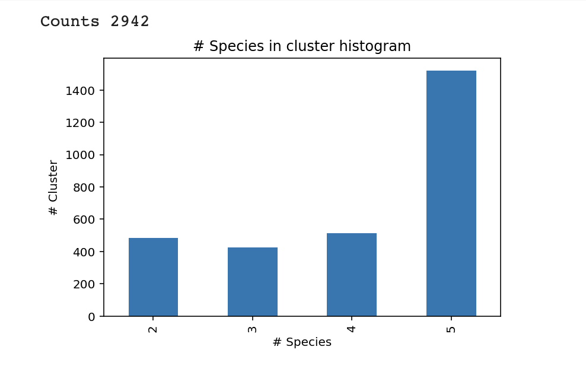
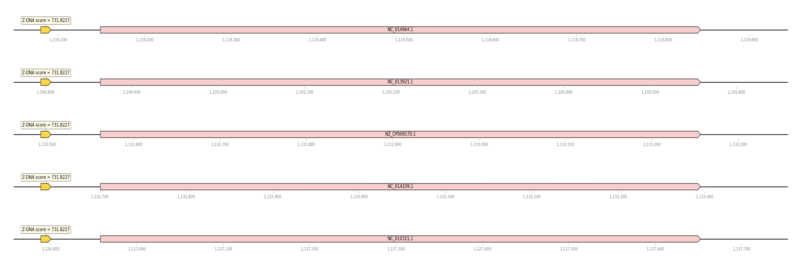

# biominor_hse22_project

## Сводная таблица
|Название вида|Кол-во посл-тей|Общая длина посл-тей|Кол-во аннотированных генов|Доля аннотированных генов|Кол-во участков с zh-score >500|Общая длина участков с zh-score >500|
|-|-|-|-|-|-|-|
|Thermoanaerobacter brockii subsp. finnii Ako-1|1|2344824|2308|88.38%|252|2414|
|Thermoanaerobacter italicus Ab9|1|2451061|2384|88.36%|254|2436|
|Thermoanaerobacter kivui|1|2397824|2438|87.04%|416|4074|
|Thermoanaerobacter mathranii subsp. mathranii str. A3|1|2306092|2245|88.42%|231|2212|
|Thermoanaerobacter pseudethanolicus ATCC 33223|1|2362816|2322|88.22%|258|2480|

## Обнаружено 2942 кластера

## Кластеры
|   # Species | Функция                                              |   ZH-score 0 |   ZH-score 1 |   ZH-score 2 |   ZH-score 3 |   ZH-score 4 |
|------------:|:-----------------------------------------------------|-------------:|-------------:|-------------:|-------------:|-------------:|
|           5 | RNA polymerase sporulation sigma factor SigK         |      731.823 |      731.823 |      731.823 |      731.823 |      731.823 |
## Множественное белковое выравнивание кластеров
cluster0.faa
## Визуализация

## Бонус
Визуализация не помещается в git - можно посмотреть в colab.
